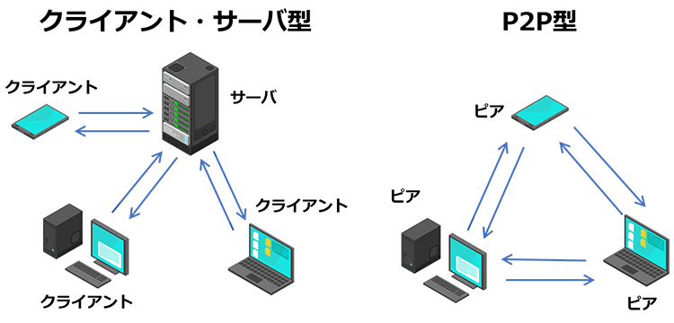

# The World of Blockchain
ブロックチェーンの世界

  
    Press Space for next page <carbon:arrow-right class="inline"/>
  

  <button @click="$slidev.nav.openInEditor()" title="Open in Editor" class="text-xl slidev-icon-btn opacity-50 !border-none !hover:text-white">
    <carbon:edit />
  </button>
  <a href="https://github.com/slidevjs/slidev" target="_blank" alt="GitHub" title="Open in GitHub"
    class="text-xl slidev-icon-btn opacity-50 !border-none !hover:text-white">
    <carbon-logo-github />
  </a>

---
layout: two-cols
---

# 技術の基礎について
目的: ブロックチェーンの技術背景をわかりやすく伝えることを目的にする。

- なぜ今？
  
- 起源
- なぜ有用だとされたのか
  - ビザンチン将軍問題の解決
- なぜ信頼がいらないのか
  - ブロックチェーンの仕組みによるもの
    - 全体の仕組み
    - 合意形成
    - マイニング
- 合意形成のされ方

::right::

# 現在と未来について
目的: ここ2ヶ月ほどで学んでいくブロックチェーンの技術についてアウトプットし、現在の技術と実用例を踏まえ未来を語ることで有意義な発表にする。

- ethereum
  - ワールドコンピュータの実現へ
- ethereum 2.0
  - Ethereumの現在
- 実用・応用の現在
- ブロックチェーンシステムの未来

<!--
タイトルそれぞれの日本語洗練させる。
-->

 
 

<!--
You can have `style` tag in markdown to override the style for the current page.
Learn more: https://sli.dev/guide/syntax#embedded-styles
-->

---

  

    

      
    

  

  

    <h2>自己紹介</h2>
  

 

- 廣岡晃一
- 2022/6 PG加入
- バックエンドコース
- shinonomeでインターン中(4月~今日までひたすらcarcloudという案件のバックエンドの開発をしてます)
- 趣味　
  - ボクシング  仕事終わりに奇妙なシュッシュという声を発しながら、無心でサンドバックと師匠のミットにパンチを繰り出しています

---

# なぜ今ブロックチェーンについて自分が語るのか？

- 最近自分が興味を持って集中的に勉強しているから
  - 個人的な興味に関しては終盤で話すつもりである
- インターネットの次の時代を作りうる技術である
- 『web3 ホワイトペーパー 2024』
>“JAPAN IS BACK, AGAIN”
AI、IoT、メタバースといった技術に加え、ブロックチェー
ンも重要な技術の一つと捉え、関連技術に注目し世界をリードする決意が表明されている

---
layout: cover
---

# ブロックチェーンの起源
そもそもブロックチェーンの技術はいつ誰が考え出したのか

---
layout: center
transition: fade-out
---

# **Peer-to-Peer** Electronic Cash System
Satoshi Nakamotoが発表した論文が起源のBitconinシステム

>信用に依存しない電子取引のシステム
[Bitcoin: A Peer-to-Peer Electronic Cash System](https://bitcoin.org/bitcoin.pdf)
Satoshi Nakamoto

 

- 世の中の多くのシステム: 運営会社等の第三者機関を信頼"トラスト"した上で成り立つ
- ブロックチェーン:  その"トラスト"を必要としない

---

# Peer-to-Peer とは
第三者を介さず直接 ユーザーや端末同士で直接データのやり取りを行う通信システム

身近な例: LINE

---

# 例: インターネットでの送金

## 従来
銀行を介して送金

## Bitcoin
使われていない残高とそれを持つアドレスのデータをブロックチェーンに取り込むことで銀行のような第三者機関を必要としない送金ができる(Unspent Transaction Output)

---
layout: cover
---

# なぜこのような仕組みが成り立つのか？

---

---

# コンセンサスのアルゴリズム
従来の信頼を仕組みで生み出しインターネット上での信頼できない不特定者とのやり取りを可能にする。

